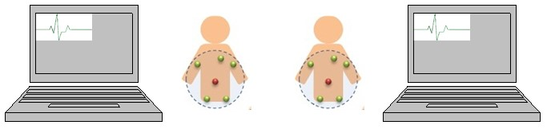

This is the project related to my master thesis. Wireless Body Area Network consider the scenario that people wearing several devices like sensors for monitoring heart rate, blood sugar level … etc. Like the figure below, every person might wear several sensors (green) for different purposes. After gathering data for a period, sensors would send data to the data aggregator (red) for further process.

Several issues make WBAN different than the classical network environment. First, people move. This indicates that the structure of network changes all the time. A Media Access Control mechanism should be carefully designed for such a dynamic network. Furthermore, data transmission is the major job for sensors, which is energy-consuming. If the MAC is not well-designed, data transmission would fail causing unnecessary energy waste. In my thesis I propose a fall back mechanism for WBAN and provide analytical analysis for power consumption and media usage.

Another issue for WBAN is the Quality of Service (QoS). Different senors are responsible for different kind of data and should have different priority. For this concern, we published a <a href="http://link.springer.com/article/10.1007/s10916-011-9676-3">paper</a> for QoS design under the scenario of multiuser WBAN.

<h3>Embedded system implementation</h3>

The project also aimed to develop a prototype of a low-power ECG sensor device. We worked with a hardware design group for antenna design and modulation implementation. I was in charge for the embedded system prototype development. We’ve developed the prototype on the chip MSP430 made by Texas Instrument combined with their antenna module.  The figure below shows the scenario for demonstration:

Here we consider two networks (two people) coexist at the same place. Sensors are continuously collecting electrocardiography (ECG) data and send to the data aggregator periodically. After receiving data, data aggregator would send the data to computer and show the ECG on a self-coded java oscilloscope.

These are the devices we designed. Basically we assume a person wears two sensors and one data aggregator (the one in the middle connect to the RS232 cable). Sensors would periodically send ECG data to the data aggregator.

This figure is a screenshot of the java oscilloscope. This demo shows that the design for network coexistence is valid. Finally here is a clip for real time ECG measurement:

<iframe width="560" height="315" src="https://www.youtube.com/embed/A_JTBqFXWYA" frameborder="0" allowfullscreen></iframe>

