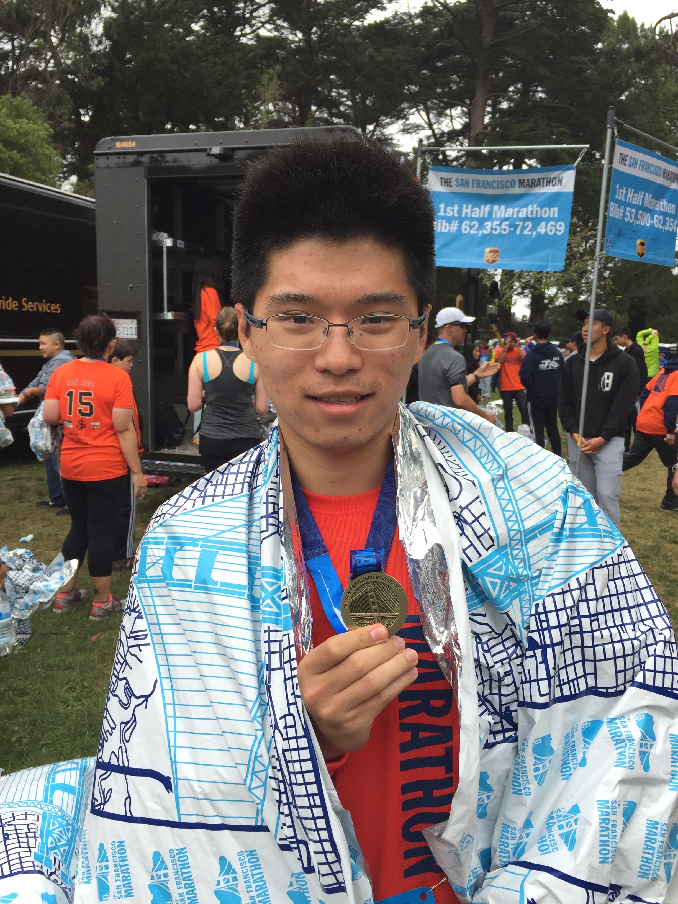

Hi, I am a Ph.D student in the Statistics department at the University of Michigan. Here are some interesting things (and I think they are cool) about me.

- I practice archery.  

I have practiced archery since 2006 when I went to the college.

- I train for marathon.  
  
Actually, I can only accomplish half marathon right now. But I am going to practice more for the full marathon.

- I love snowboarding.  
  
I just "graduated" from the bunny hill and trying green lines right now.

