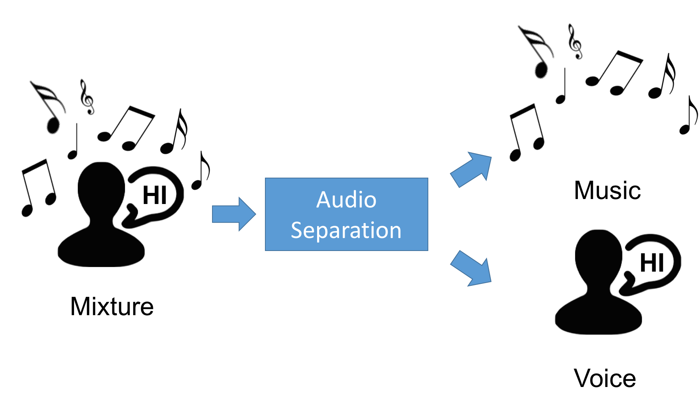
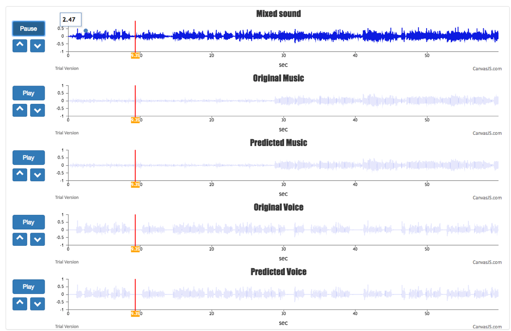
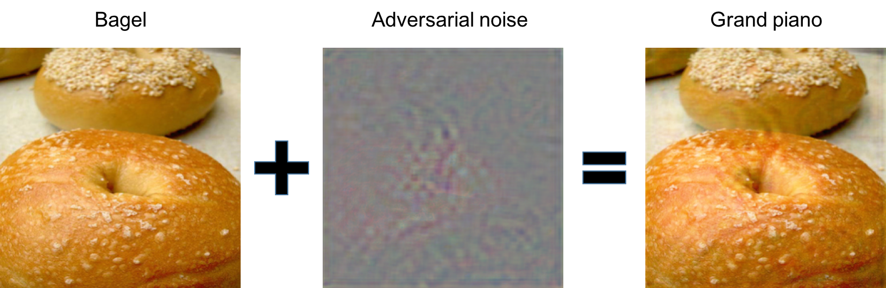
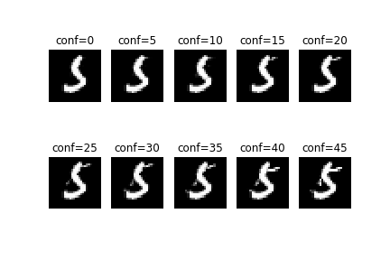
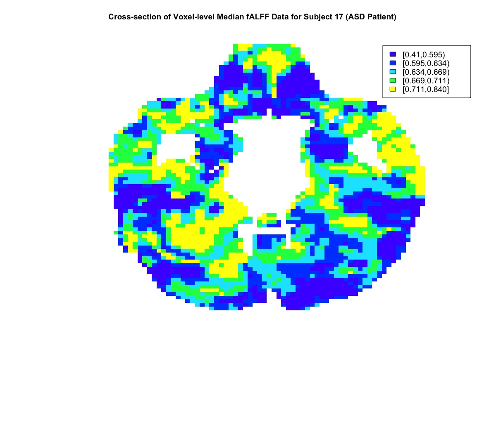
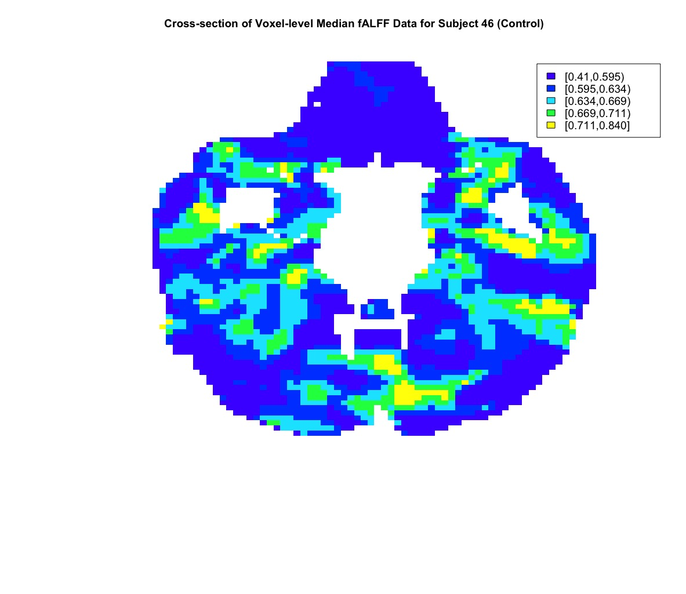
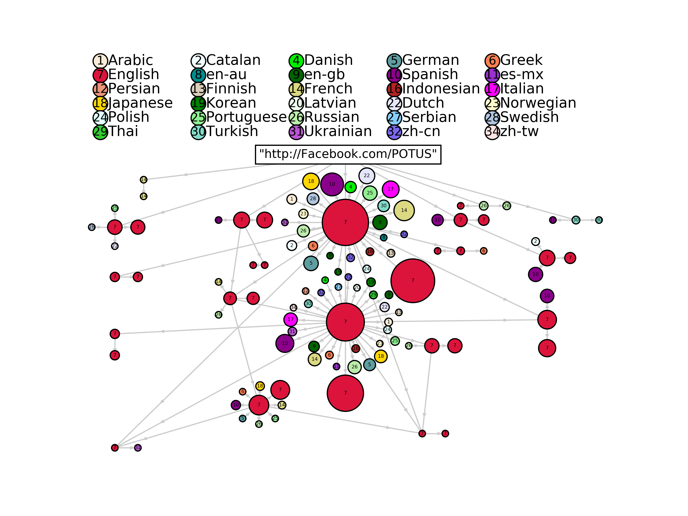
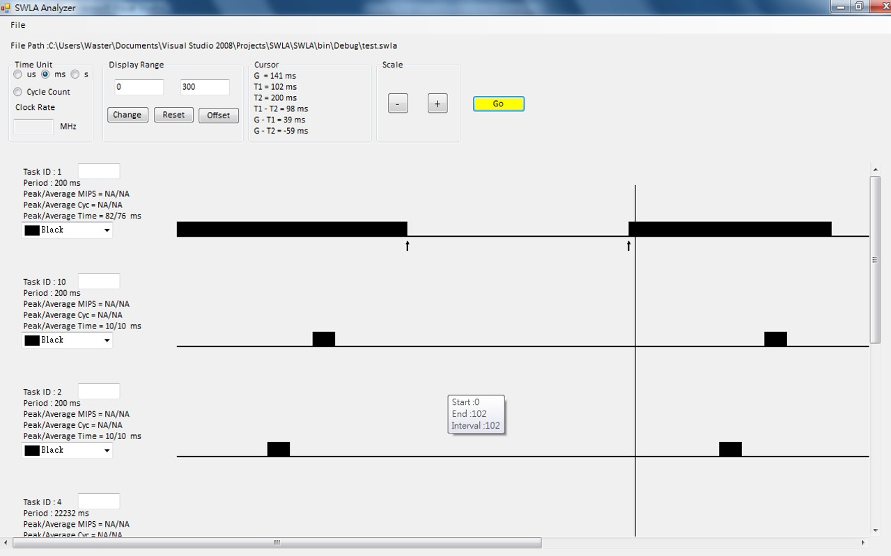

Here are several projects I have done during different stages of my life:

<nav class="toc">
<ul id="markdown-toc">
  <li><a href="#bose" id="markdown-toc-bose">Internship, Bose Corporation</a></li>
  <li><a href="#UM" id="markdown-toc-UM">Ph.D candidate, University of Michigen</a></li>
  <li><a href="#raNCTU" id="markdown-toc-raNCTU">Research Assistant, NCTU</a></li>
  <li><a href="#mediatek" id="markdown-toc-mediatek">Internship, MediaTek Inc.</a></li>
  <li><a href="#masterNCTU" id="markdown-toc-masterNCTU">Master, NCTU</a></li>
  <li><a href="#underNCTU" id="markdown-toc-underNCTU">Bachelor, NCTU</a></li>
  <li><a href="#highSchool" id="markdown-toc-highSchool">High school</a></li>
</ul>
</nav>

<h2 id="bose" style="text-align: center"> Internship, Bose Corporation</h2>

<h3> Audio Source Separation (2018) </h3>

I worked as an Audio Machine Learning Intern at the Bose Corporation. My duties included conducting research on the problem of Audio Separtion, establishing data processing pipeline on AWS and desiging the demonstration interface. 

Audio Separtion is a challening problem since only the mixed sound track is given and we are asked to isolate different sources from the mixture. We consider the situation that someone is talking while there is a background music playing at the same time. As the figure shown above, through the Audio Separation system, the mixture should be separated into Music and Voice. 

In order to demonstrate my internship accomplishment, I further implemented a real-time web interface showing the waveforms of different sources. It displays the mixed sound track, the true Music/Voice track and the predicted Music/Voice track. As the track is playing, the time pointer (red bar) will move accordingly and will be synchronized among all five sources. You can also easily switch speakers' output while the track is playing without any delay. There is also a zoom in/zoom out feature for the user to examine the difference bettween the true and the predicted sources. The whole demonstration system is built using JavaScript. We use Django as an backend server to handle user requests.

<h2 id="UM" style="text-align: center"> Ph.D candidate, University of Michigan</h2>

<h3> Adversarial Machine Learning for Neural Networks (2017 till now) </h3>
Deep neural networks can achieve promising performance in many machine learning problems. However, recent research raises a great concern on the robustness of the neural network model. Adversarial exmaples made by imperceptible changes can lead to wrong classification results. In this project we develope a black-box attack with 30% less query times compared to the state-of-the-art. 

The figure below shows an example of an adversarial image. We pick a bagel image from imagenet as our target and with our the black-box attack method, we can find a barely noticeable noise that will fool the classifier and mis-classified the image as a grand piano. 

We can also generate high-confidence examples. The figure below shows an example from the MNIST dataset. The original (with `conf=0`) image is classified as 3. Targeting at class 5, we can generate different images at different confidence levels. With higher `conf`, the image would looks more like number 5. 

This idea is further extended to model interpretability. We use Contrastive Explanation Method ([*CEM*](https://arxiv.org/pdf/1802.07623.pdf)) to find out the key features for facial attributes recognition.  The figures below show the example of identifying the *smiling* attribute. The left figure is the original figure, which *smiling* is not detected and the right figure is the figure modified by CEM so that *smiling* is recognized. As we can see, it is the area around the mouth that will make the difference, which follows our definition of smiling.

<h3> Face Pose Prediction and Dataset Visualization (2016)</h3>
The [*face dataset*](http://isomap.stanford.edu/datasets.html) contains several image of statue. These images can be treated as high-dimensional data and my current research is about to build a prediction model to predict face poses (Light, Pan, Light) from a given image. [*Here*](http://www-personal.umich.edu/~timtu/facelist.html) are some javascript tools I used for visualization and to observe and evaluate the performance of my method.

<h3> Exploration of Spatial Association among Brain Regions (2016)</h3>

This is a final project of the course Spatial Data Analysis. In this project we focus on the analysis of fractional Amplitude of Low Frequency Fluctuations (fALFF) data obtained from resting state functional magnetic resonance imaging (fMRI) to investigate whether there exists a spatial pattern among 116 anatomical brain regions of interest and, if so, to determine how strong is this spatial pattern. We further investigate whether region-level median fALFF data has prognostic value in identifying patients with Autism Spectrum Disorder (ASD).

Below the figure shows the cross-sectional images of voxel-level fALFF data for a patient with ASD (left figure) and a control patient (right figur). Based on these images there does appear to be spatial correlation among voxels with regard to fALFF values.

<figure class="half">
	
	
	<figcaption> </figcaption>
</figure>

For variable selection purpose, we next consider several possible spatial models and compare them with regular models (with no spatial information). The models are trained with [*OpenBugs*](http://www.openbugs.net/w/FrontPage) under Baysian framework. From the simulation results we conclude that by adding spatial concepts into the model, we could obtain a better selection of variables. Finally, the spatial model is trained using the real brain data. The goal is to select prognostic brain regions for ASD patients. Our results show that 18 brain regions are selected and some of them are related to ASD from several literatures.

<h3> Information Propagation Using Twitter Dataset (2015)</h3>
This is the final project of the course Graph Mining. We crawl the twitter for a specific event and construct an event propagation network. By using the network of network characteristics, we may control (accelerate or deaccelerate ) the speed of event propagation. Below is a visualization of the propagation of the event “Obama announced his personal FB page”.

In this figure, a single node indicates a group of users using the same language. The size of a node represents the group size. The edges with arrows mark the direction of the information propagting to. We use different colors and language codes to label different languages and the legends are shown on top of the figure. The Network of Network (NoN) structure is observed in this figure. For example, users using Engligh tend to retweet posts from English users. By using this NoN characteristic, we can identify influetial links and control the propagation of the information. See [*here*](https://arxiv.org/abs/1609.05378) for the paper on the arXiv for more details.

<h3> Generalized Linear Models Implementation Using C++ (2015)</h3>
This is another final project from Statistical Computing. The R package <i>glmnet</i> is a widely used statistical tool for doing regression analysis. It is written in Fortran language. Our team rewrite the package using C++ and we achieve similar code efficiency.

<h2 id="raNCTU" style="text-align: center">Research Assistant, NCTU</h2>
<h3>Machine Learning Integrated System Prototype (2013 - 2014)</h3>

This is the coolest project I have done ever since. It is well-known that machine learning methods are usually computationally intensive. In the view of this, we try to accelerate these algorithm through two approaches: distributed system (Hadoop) and Application-specific integrated circuit (ASIC). The embedded system plays an important role here. Each device has to communicate with Hadoop and the hardware design.  In order to utilize the distributed system provided by Hadoop, I have to dig into its source code. The communicate between embedded system and the hardware design (FPGA) requires firmware design. I learn a lot from this project. See [*here*](/share/#hadoop) for more information about my notes on Hadoop.

<h2 id="mediatek" style="text-align: center">Internship, MediaTek Inc.</h2>

<h3> Packet Analyzer and Event Oscilloscope (2011)</h3>
During the internship, I finished two graphical analytical programs. One is a packet analyzer for debugging. This analyzer would convert the bit data into human readable format. I also add some other functions to add/edit/delete packets. (I think it is inappropriate to put pictures of this here since it might contain some internal information.)

Another program aims to  provide oscilloscope-like function. For some situations, we would like to compare the occurrence of events. This tool provides a graphical interface to visualize the time when an event happen and you can even measure the time difference. 

<h2 id="masterNCTU" style="text-align: center">Master, NCTU</h2>

Wireless Body Area Network is the main topic of my master thesis. Please see [*this page*](../WBAN/) for more details.

<h2 id="underNCTU" style="text-align: center">Bachelor, NCTU</h2>

<h3> 3D Volume Rendering Acceleration Using CUDA (2010)</h3>

Volume rendering is a fundamental and important technique in computer graphics. It is implemented to project a 3D object onto a 2D plane so that the object can be displayed on the screen. The classical way of doing this is through Ray Casting. We can imagine we are standing at a point looking at the object. To render the object, we can cast a viewing ray toward a plane. The place where the ray hit would be the final rendering result. A viewing ray can only determine the value for a pixel. Thus, imagine rendering a 1024 by 1024 scene, we would need 2^20 ray casting calculations, which would be a burden for CPU.

This is a final project of Computer Architecture. Basically we take the advantage of parallel computing of GPU. This project is modified from the Nvidia example and aim to figure out the best setting of hardware setting for GPU. Below is the 3D texture model we used:

<h3> 3D Interactive Scenario Using OpenGL (2008) </h3>
This is a final project for the Computer Graphic course. At first I planned to implement a maze. But you know finals … In the end it became an interactive scenario. (A maze with no wall!)

Players can use arrow keys to control the panel and the red ball will fall to the lower side. This looks easy but I adopt a lot of computer graphics techniques inside. First there are two self-defined shaders, vertex shader and fragment shader, to handle the details of rendering a scene. Also, there is a ball on the very top reflecting the maze, which requires binding the reflection on the sphere. Finally, the ball should react properly to the user behavior and physics rules should also be applied.

<h3>Digital Monster Using 8051 Microcontroller (2007) </h3>

[*Digital Monster*](https://en.wikipedia.org/wiki/Digimon) (or Digimon) was a toy I really want when I was a child. One attractive feature of this toy is that you can attach your device to another device and “BATTLE”. Thus, at the end of the course Microcontroller my teammate and I choose to implement this on our own to cherish this memory.

<figure class="half">
	
	
	<figcaption> </figcaption>
</figure>
The left figure is a picture of the true Digimon device, captured from [*here*](http://www.tomopop.com/toys-of-yesterday-digimon-14779.phtml). And the right figure is the self-made Digimon device.

Ok I admit the outfits have nothing in common. However, the self-made Digimon device has all the functions that the true one has: feeding pets, playing with pets and the most important of all, BATTLE!

For this implementation we use a phone (the panda-looking stuff) as an input. This is good choice for the input source since the phone is designed with capacitors. This means that the phone can automatically buffered your inputs even if you press buttons really fast. This saves a lot of time handling response time.

We use the LCD to display our digimon and some information. For displaying customized graph, we need to program the internal memory of the LCD first, which takes some time when booting up.

Finally, the BATTLE function is implemented using external interrupts. When two device connect together and start the battle, players have to press a certain button to obtain scores. The player with the highest score after one minute wins the battle.

<h2 id="highSchool" style="text-align: center">High School</h2>

<h3>3D Game Function Demo Using DirectX 3D (2005-2006)</h3>

This is my first “runnable” program. I still remember the pain of setting up all the environment configurations, adding a lot of printf to debug and making my computer crash because of memory leakage (since then I have a fear of seeing the blue screen). Fortunately I have enough patience and my computer was tough enough to go through all of these.

In retrospect, picking the <a href="https://www.amazon.com/Programming-Playing-Games-DirectX-Development/dp/159200315X">right book</a> as a guidance is the wisest decision I have ever made. Within two years, I learned the core knowledge of computer science from scratch. Data structure, algorithm and basic computer graphic are covered in this book. When graduating from high school, I finished my first C++ program and I was equipped with basic knowledge of computer science.

Here is a screenshot of the combat scene. All the 3D models, materials and some core functions are  from the book.

